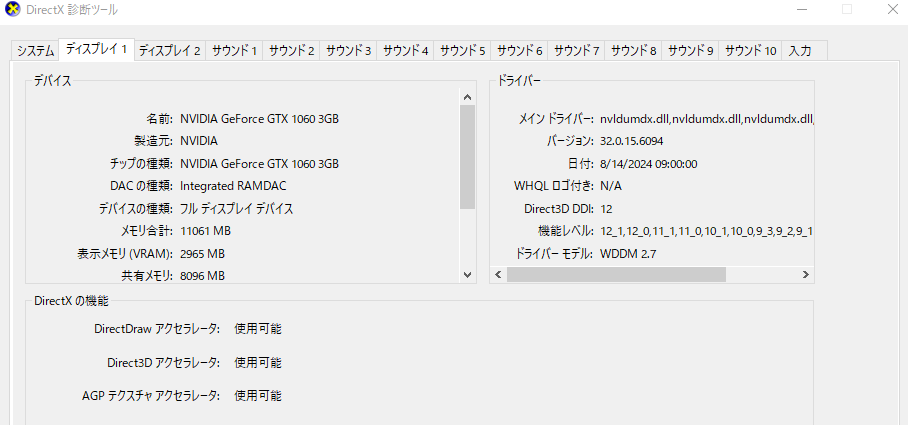

# Direct3D12

# Chapter2-DirectXの導入

## DirectX12の初期化

DirectXの初期化では次のオブジェクトの生成が必要になる。

- デバイスの生成
- コマンドキューの生成
- スワップチェインの生成
- コマンドアロケータの生成
- コマンドリストの生成
- レンダーターゲットビューの生成
- フェンスの生成

描画コマンドはコマンドリストに渡され、コマンドリストをコマンドキューが受け取り、GPUが受け取ったコマンドキューからリストを取り出してコマンドを実行する。

つまり、コマンドの実行のためには、先んじてデバイス、コマンドキュー、コマンドリストを生成する必要がある。

### デバイスの生成
Direct3Dデバイスは、ハードウェア(特にGPU)を操作するためのインターフェースであり、物理デバイスそのものを指す。
```
// デバイスの作成
auto hr = D3D12CreateDevice(
	nullptr, // 使用するビデオアダプタへのポインタ。既定のアダプタを利用する場合はnullptrを渡す。
	D3D_FEATURE_LEVEL_11_0, // 最小D3D_FEATURE_LEVEL
	IID_PPV_ARGS(m_pDevice.GetAddressOf()) // デバイスインターフェースを受け取るポインタ。IID_PPV_ARGSマクロを使うことで、uuidofによるGUIDの取得とvoid**へのキャストを行う。
);
// デバイスが正しく生成されたかチェック
if (FAILED(hr))
{
	return false;
}
```

Windowsにおいて利用可能なD3Dデバイスは様々な方法で調べることができる。

最も簡単な方法はDirectX診断ツールを使用する方法であり、ツールのディスプレイタブを選択すると、D3Dデバイスに関する情報が表示される。



アプリケーション側から調べたければ、IDXGIFactory1::EnumAdapters1関数を使うことでデバイスの列挙ができる。
```
UINT i = 0; 
IDXGIAdapter1 * pAdapter; 
std::vector <IDXGIAdapter1*> vAdapters; 
while(pFactory->EnumAdapters1(i, &pAdapter) != DXGI_ERROR_NOT_FOUND) 
{ 
	vAdapters.push_back(pAdapter); 
	++i; 
} 
```

### コマンドキューの作成

コマンドキューはGPUにコマンドリストを渡し、実行するためのオブジェクトである。

```
{
	D3D12_COMMAND_QUEUE_DESC desc = {};
	desc.Type = D3D12_COMMAND_LIST_TYPE_DIRECT;
	desc.Priority = D3D12_COMMAND_QUEUE_PRIORITY_NORMAL;
	desc.Flags = D3D12_COMMAND_QUEUE_FLAG_NONE;
	desc.NodeMask = 0;

	hr = m_pDevice->CreateCommandQueue(&desc, IID_PPV_ARGS(&m_pQueue));
	if (FAILED(hr))
	{
		return false;
	}
}
```

- Type : キューの用途を指定する。
    パイプラインによってTypeを決定する。
    - DIRECT : 全てのコマンドリストを実行可能。
    - COMPUTE : コンピュートシェーダのために利用する。グラフィックス系のコマンドは使用不可。
    - COPY : メモリコピーに利用する。描画コマンド、計算コマンドは使用不可。
    このほかにもD3D12_COMMAND_LIST_TYPEは値を持っているが、以下の値はコマンドキューの初期化に利用できない。
    - BUNDLE : バンドルリストと呼ばれる、コマンドの再利用を目的としたコマンドリストの作成に利用
    - VIDEO* : ビデオ処理専用のコマンドを実行する。ビデオ処理用のコマンドキューは```CreateVideoCommandQueue()```で作成する。
- Priority : コマンドキューの優先度を指定する。
    定数として用意されているものは次の3つ。
    - NORMAL : 0. デフォルトの優先度
    - HIGH : 100. 優先度高
    - GLOBAL_REALTIME : 10000. 最高の優先度を持つ。超低遅延が求められ、かつ軽量なコマンドである場合利用することがある。ゲーム開発では滅多に使わず、VR、ARのリアルタイムレンダリングなどに用いる場合使う可能性がある。
- Flags : 定数は2つしか用意されていないので、事実上、GPUタイムアウトの有無を決定する。
    - NONE : デフォルト値。GPUタイムアウトを有効にする。
    - DISABLE_GPU_TIMEOUT : GPUタイムアウトを有効にする。GPUに問題が生じて停止した場合でもコマンドの実行を継続する。GPUが停止しても結果が返ってくることが保証されていない場合、デッドロックが発生する。

### SwapChainの作成
バックバッファリングを行うためのオブジェクトであり、フロント/バックバッファの切り替えやポインタの管理を行う。

```
// スワップチェインの設定
// https://learn.microsoft.com/ja-jp/windows/win32/api/dxgi/ns-dxgi-dxgi_swap_chain_desc
DXGI_SWAP_CHAIN_DESC desc = {};
desc.BufferDesc.Width = m_Width;
desc.BufferDesc.Height = m_Height;
desc.BufferDesc.RefreshRate.Numerator = 60; // リフレッシュレートの分母
desc.BufferDesc.RefreshRate.Denominator = 1; // リフレッシュレートの分子
desc.BufferDesc.ScanlineOrdering = DXGI_MODE_SCANLINE_ORDER_UNSPECIFIED; // 走査線の処理順の指定をしない
desc.BufferDesc.Scaling = DXGI_MODE_SCALING_UNSPECIFIED; // スケーリングの設定
// https://learn.microsoft.com/ja-jp/windows-hardware/drivers/display/scaling-the-desktop-image
desc.BufferDesc.Format = DXGI_FORMAT_R8G8B8A8_UNORM; // 表示フォーマットの指定
// https://learn.microsoft.com/ja-jp/windows/win32/api/dxgiformat/ne-dxgiformat-dxgi_format
desc.SampleDesc.Quality = 0; // 画像の品質レベル
desc.SampleDesc.Count = 1; // ピクセルあたりのマルチサンプリング数
desc.BufferUsage = DXGI_USAGE_RENDER_TARGET_OUTPUT;
desc.BufferCount = FrameCount; // FrameCount = 2;
desc.OutputWindow = m_hWnd;
desc.Windowed = DXGI_SWAP_EFFECT_FLIP_DISCARD;
desc.SwapEffect = DXGI_SWAP_EFFECT_DISCARD;
desc.Flags = DXGI_SWAP_CHAIN_FLAG_ALLOW_MODE_SWITCH;

// スワップチェインの作成
IDXGISwapChain* pSwapChain = nullptr;
hr = pFactory->CreateSwapChain(m_pQueue.Get(), &desc, &pSwapChain);
if (FAILED(hr))
{
	SafeRelease(&pFactory);
	return false;
}

// IDXGISwapChain3を取得し
// フィールドに格納する
// IDXGISwapChain3 m_pSwapChain;
hr = pSwapChain->QueryInterface(IID_PPV_ARGS(&m_pSwapChain));
if (FAILED(hr))
{
	SafeRelease(&pFactory);
	SafeRelease(&pSwapChain);
	return false;
}

// 現在のバックバッファのインデックスを取得
m_FrameIndex = m_pSwapChain->GetCurrentBackBufferIndex();

// 不要になったので解放する
SafeRelease(&pFactory);
SafeRelease(&pSwapChain);
```
CreateSwapChain()でスワップチェインの作成を行っているが、引数としてコマンドキューのポインタが必要になる。そのため、先にコマンドキューを作成する必要がある。

```pSwapChain->QueryInterface(IID_PPV_ARGS(&m_pSwapChain));```によって作成したスワップチェインをIDXGISwapChain3型にキャストすると同時に、ポインタを格納している。

その後作成したスワップチェインを解放する。pSwapChainの参照カウンタが0になり解放されるが、m_pSwapChainの参照カウンタは残っているため、pSwapChainは不要になる。

### コマンドアロケータの作成

コマンドキューを作成したら、ここに格納するコマンドリストを作成するが、コマンドリストの作成にはコマンドアロケータの作成が必要になる。

コマンドアロケータはコマンドリストに格納される命令のメモリ管理を行う。

```
	// コマンドアロケータの作成
	// コマンドリストに割り当てられたメモリを管理する
	{
		for (auto i = 0u; i < FrameCount; i++)
		{
			hr = m_pDevice->CreateCommandAllocator(
				D3D12_COMMAND_LIST_TYPE_DIRECT,
				IID_PPV_ARGS(&m_pCmdAllocator[i])
			);
			if (FAILED(hr))
			{
				return false;
			}
		}

	}
```
一般的に、コマンドアロケータはスワップチェインのバッファ数分だけ作成する必要がある。
ダブルバッファリングする際にコマンドアロケータが1つのみである場合を考える。

1. フレーム1の描画コマンドをコマンドリストに記録する。
2. コマンドキューに送信する。
3. GPUで処理する。
4. フレーム2の描画コマンドをコマンドリストに記録する。

ここで、手順4でコマンドリストに記録するためには、手順3でコマンドを全て実行し、アロケータをリセットする必要がある。つまり、GPUの処理が終了するまでCPUは進行不能になる。

コマンドアロケータがバッファ数存在すれば、描画処理を行っていないバックバッファのコマンドアロケータは確実にリセットすることができ、メモリ管理において競合することが無くなる。これによりGPUの処理を待たずにCPUの処理、コマンドリストの作成を行うことができるため、CPUとGPUの処理性能を高くすることができる。

ダブルバッファリングだけでなく、トリプルバッファリングについても同様に対応できる。

以上の理由により、コマンドアロケータはスワップチェインの後に作成することが推奨される。

### コマンドリストの作成
描画コマンドや計算コマンドなど、GPUで実行される命令を格納する。

```
// コマンドリストの作成
{
	hr = m_pDevice->CreateCommandList(
		0, // 複数のGPUノードがある場合に識別するためのビットマスク。GPUが1つの場合は0を割り当てる
		D3D12_COMMAND_LIST_TYPE_DIRECT, // コマンドリストのタイプ
		m_pCmdAllocator[m_FrameIndex].Get(), // バックバッファのアロケータを使う
		nullptr, // パイプラインステート。後で明示的に設定するためnullptrを渡しておく
		IID_PPV_ARGS(&m_pCmdList) // GUID
	);
	if (FAILED(hr))
	{
		return false;
	}
}
```
ここで指定するコマンドリストのタイプは、コマンドキュー、アロケータと同一のものにする。
### ディスクリプタの作成

**ディスクリプタ** : リソースが何かを定義するもの。
**ディスクリプタヒープ** : ディスクリプタを格納するためのヒープ。CPUに作成されるかGPUに作成されるか設定可能。
**レンダーターゲットビュー(RTV)** : 描画内容を格納するためのバッファ。

次のコードではRTVのディスクリプタを作成している。

```
// ディスクリプタヒープの作成
// 今回はバッファをリソースとする
D3D12_DESCRIPTOR_HEAP_DESC desc = {};
desc.NumDescriptors = FrameCount; // ヒープ内のディスクリプタの数。今回はバッファの分だけ作成する。
desc.Flags = D3D12_DESCRIPTOR_HEAP_FLAG_NONE; // _SHADER_VISIBLEの場合はシェーダから参照できるようになる。
desc.NodeMask = 0; // GPUノードの識別
desc.Type = D3D12_DESCRIPTOR_HEAP_TYPE_RTV; // ディスクリプタヒープの種類を指定。RTVはレンダーターゲットビューのこと。

hr = m_pDevice->CreateDescriptorHeap(&desc, IID_PPV_ARGS(&m_pHeapRTV));
if (FAILED(hr))
{
	return false;
}
// ディスクリプタヒープの先頭メモリ位置を取得
auto handle = m_pHeapRTV->GetCPUDescriptorHandleForHeapStart();
// ディスクリプタのメモリサイズを取得
// GetDescriptorHandleIncrementSize(type)はデバイス依存の固定値を返す
auto incrementSize = m_pDevice->GetDescriptorHandleIncrementSize(desc.Type);
for (auto i = 0u; i < FrameCount; i++)
{
	// バックバッファを取得
	hr = m_pSwapChain->GetBuffer(i, IID_PPV_ARGS(&m_pColorBuffer[i]));
	if (FAILED(hr))
	{
		return false;
	}
	D3D12_RENDER_TARGET_VIEW_DESC viewDesc = {};
	viewDesc.Format = DXGI_FORMAT_R8G8B8A8_UNORM;
	viewDesc.ViewDimension = D3D12_RTV_DIMENSION_TEXTURE2D; // どのような次元でリソースにアクセスするか？
	viewDesc.Texture2D.MipSlice = 0; // ミップマップレベル
	viewDesc.Texture2D.PlaneSlice = 0; // 使用テクスチャの平面のインデックス
	// レンダーターゲットビューの作成
	m_pDevice->CreateRenderTargetView(m_pColorBuffer[i].Get(), &viewDesc, handle);
	m_HandleRTV[i] = handle;
	handle.ptr += incrementSize; // 次のディスクリプタの位置を設定
}
```

- NumDescriptors
    RTVは描画内容を書きこむバッファなので、少なくともフレーム数必要である。
- Flags
    - D3D12_DESCRIPTOR_HEAP_FLAG_NONE
        既定の使用方法。ヒープはCPUからのみ参照できる。ただし、CPUにステージングされたディスクリプタをコピーしてGPUに渡すことは可能。RTVやDepth Stencil View(DSV)のディスクリプタはシェーダ―から参照できないのでコピー不可。
    - D3D12_DESCRIPTOR_HEAP_FLAG_SHADER_VISIBLE
        ディスクリプタヒープをGPUアクセス可能なGPU仮想メモリに作成する。CPUからアクセス不可になるため、CPU側からもアクセスしたい場合はコピーを駆使する必要がある。VRAMのサイズ以上にヒープを作成したらページング機能によりRAM等にオフロードされるはずだが、どれくらい遅くなるのか気になる。


以下はCPUにステージングされたディスクリプタをGPU参照可能にする例。
```
// 1. CPU ステージング用のディスクリプタヒープ (D3D12_DESCRIPTOR_HEAP_FLAG_NONE)
D3D12_DESCRIPTOR_HEAP_DESC cpuHeapDesc = {};
cpuHeapDesc.NumDescriptors = 1;
cpuHeapDesc.Type = D3D12_DESCRIPTOR_HEAP_TYPE_CBV_SRV_UAV;
cpuHeapDesc.Flags = D3D12_DESCRIPTOR_HEAP_FLAG_NONE; // CPU のみ
device->CreateDescriptorHeap(&cpuHeapDesc, IID_PPV_ARGS(&cpuDescriptorHeap));

// 2. GPU 参照可能なディスクリプタヒープ (D3D12_DESCRIPTOR_HEAP_FLAG_SHADER_VISIBLE)
D3D12_DESCRIPTOR_HEAP_DESC gpuHeapDesc = {};
gpuHeapDesc.NumDescriptors = 1;
gpuHeapDesc.Type = D3D12_DESCRIPTOR_HEAP_TYPE_CBV_SRV_UAV;
gpuHeapDesc.Flags = D3D12_DESCRIPTOR_HEAP_FLAG_SHADER_VISIBLE; // GPU 参照可能
device->CreateDescriptorHeap(&gpuHeapDesc, IID_PPV_ARGS(&gpuDescriptorHeap));

// 3. ディスクリプタの作成 (CPU 側)
D3D12_CPU_DESCRIPTOR_HANDLE cpuHandle = cpuDescriptorHeap->GetCPUDescriptorHandleForHeapStart();
D3D12_SHADER_RESOURCE_VIEW_DESC srvDesc = {};
srvDesc.ViewDimension = D3D12_SRV_DIMENSION_TEXTURE2D;
srvDesc.Shader4ComponentMapping = D3D12_DEFAULT_SHADER_4_COMPONENT_MAPPING;
srvDesc.Format = DXGI_FORMAT_R8G8B8A8_UNORM;
srvDesc.Texture2D.MipLevels = 1;
device->CreateShaderResourceView(texture, &srvDesc, cpuHandle);

// 4. CPU から GPU のヒープへコピー
D3D12_CPU_DESCRIPTOR_HANDLE srcHandle = cpuDescriptorHeap->GetCPUDescriptorHandleForHeapStart();
D3D12_CPU_DESCRIPTOR_HANDLE dstHandle = gpuDescriptorHeap->GetCPUDescriptorHandleForHeapStart();
device->CopyDescriptorsSimple(1, dstHandle, srcHandle, D3D12_DESCRIPTOR_HEAP_TYPE_CBV_SRV_UAV);

// 5. GPU にセット (シェーダーに渡す)
ID3D12DescriptorHeap* descriptorHeaps[] = { gpuDescriptorHeap };
commandList->SetDescriptorHeaps(1, descriptorHeaps);
commandList->SetGraphicsRootDescriptorTable(0, gpuDescriptorHeap->GetGPUDescriptorHandleForHeapStart());
```
